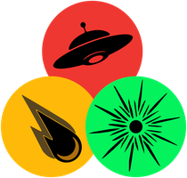
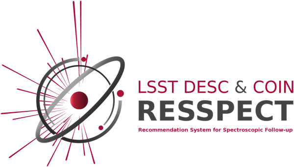

---
hide:
  - toc
  - navigation
---

# light-curve

**High-performance time-series feature extraction for astrophysics.**

`light-curve` is a Python package for analyzing photometric light curves at the scale of millions of objects.
It provides multiple tools for ML pre-processing pipelines as well as 40+ statistical and variability features
for filtering, classification, and catalog analysis.

```sh title="Install"
pip install 'light-curve[full]'
```

---

<div class="lc-cards">

<div class="lc-card">
<div class="lc-card-svg-wrap">
<svg class="lc-svg-features" viewBox="0 0 240 110" fill="none" xmlns="http://www.w3.org/2000/svg">
  <!-- Light curve: sinusoidal, line goes exactly through all data points -->
  <polyline points="8,60 18,74 28,82 38,79 48,68 58,53 68,41 78,38 88,46 98,60 108,74 118,82 128,79 138,68 148,53 158,41 168,38 178,46"
            stroke="white" stroke-width="1.8" fill="none" opacity="0.9"/>
  <circle cx="8"   cy="60" r="2.5" fill="white" opacity="0.9"/>
  <circle cx="18"  cy="74" r="2.5" fill="white" opacity="0.9"/>
  <circle cx="28"  cy="82" r="2.5" fill="white" opacity="0.9"/>
  <circle cx="38"  cy="79" r="2.5" fill="white" opacity="0.9"/>
  <circle cx="48"  cy="68" r="2.5" fill="white" opacity="0.9"/>
  <circle cx="58"  cy="53" r="2.5" fill="white" opacity="0.9"/>
  <circle cx="68"  cy="41" r="2.5" fill="white" opacity="0.9"/>
  <circle cx="78"  cy="38" r="2.5" fill="white" opacity="0.9"/>
  <circle cx="88"  cy="46" r="2.5" fill="white" opacity="0.9"/>
  <circle cx="98"  cy="60" r="2.5" fill="white" opacity="0.9"/>
  <circle cx="108" cy="74" r="2.5" fill="white" opacity="0.9"/>
  <circle cx="118" cy="82" r="2.5" fill="white" opacity="0.9"/>
  <circle cx="128" cy="79" r="2.5" fill="white" opacity="0.9"/>
  <circle cx="138" cy="68" r="2.5" fill="white" opacity="0.9"/>
  <circle cx="148" cy="53" r="2.5" fill="white" opacity="0.9"/>
  <circle cx="158" cy="41" r="2.5" fill="white" opacity="0.9"/>
  <circle cx="168" cy="38" r="2.5" fill="white" opacity="0.9"/>
  <circle cx="178" cy="46" r="2.5" fill="white" opacity="0.9"/>
  <!-- Step 1: mean line + A bracket (appear first on hover) -->
  <g class="lc-feat-s1">
  <line x1="8" y1="60" x2="178" y2="60" stroke="white" stroke-width="1" stroke-dasharray="4,3" opacity="0.5"/>
  <line x1="189" y1="38" x2="189" y2="60" stroke="#ffcc80" stroke-width="1.5"/>
  <line x1="186" y1="38" x2="192" y2="38" stroke="#ffcc80" stroke-width="1.5"/>
  <line x1="186" y1="60" x2="192" y2="60" stroke="#ffcc80" stroke-width="1.5"/>
  <text x="198" y="52" fill="#ffcc80" font-size="10" font-family="monospace" font-weight="bold">A</text>
  </g>
  <!-- Step 2: period P bracket (appears after A) -->
  <g class="lc-feat-s2">
  <line x1="78" y1="28" x2="168" y2="28" stroke="#80deea" stroke-width="1.2"/>
  <line x1="78"  y1="24" x2="78"  y2="32" stroke="#80deea" stroke-width="1.2"/>
  <line x1="168" y1="24" x2="168" y2="32" stroke="#80deea" stroke-width="1.2"/>
  <text x="123" y="20" fill="#80deea" font-size="9" font-family="monospace" font-weight="bold" text-anchor="middle">P</text>
  </g>
</svg>
</div>
<div class="lc-card-body">
<h3><a href="features/">Feature extractors</a></h3>
<p>40+ features: magnitude and flux statistics, time-series shape descriptors, period extraction, and parametric fits for transients. Supports multi-band light curves and optimized to process 10⁶–10⁹ objects.</p>
</div>
</div>

<div class="lc-card">
<div class="lc-card-svg-wrap">
<svg class="lc-svg-embed" viewBox="0 0 240 110" fill="none" xmlns="http://www.w3.org/2000/svg">
  <!-- Light curve: irregular shape, line goes through points -->
  <polyline points="6,55 12,44 18,36 24,45 30,65 36,72 42,60 48,42 52,55"
            stroke="white" stroke-width="1.5" fill="none" opacity="0.8"/>
  <circle cx="6"  cy="55" r="2.2" fill="white" opacity="0.85"/>
  <circle cx="12" cy="44" r="2.2" fill="white" opacity="0.85"/>
  <circle cx="18" cy="36" r="2.2" fill="white" opacity="0.85"/>
  <circle cx="24" cy="45" r="2.2" fill="white" opacity="0.85"/>
  <circle cx="30" cy="65" r="2.2" fill="white" opacity="0.85"/>
  <circle cx="36" cy="72" r="2.2" fill="white" opacity="0.85"/>
  <circle cx="42" cy="60" r="2.2" fill="white" opacity="0.85"/>
  <circle cx="48" cy="42" r="2.2" fill="white" opacity="0.85"/>
  <circle cx="52" cy="55" r="2.2" fill="white" opacity="0.85"/>
  <!-- Arrow: LC → network -->
  <line x1="57" y1="55" x2="62" y2="55" stroke="white" stroke-width="1.1" opacity="0.5"/>
  <polygon points="62,52 62,58 67,55" fill="white" opacity="0.5"/>
  <!-- Layer 1: input nodes -->
  <circle cx="74" cy="28" r="5.5" fill="white" opacity="0.6"/>
  <circle cx="74" cy="55" r="5.5" fill="white" opacity="0.75"/>
  <circle cx="74" cy="82" r="5.5" fill="white" opacity="0.6"/>
  <!-- Connections L1→L2 (looping animation) -->
  <line class="lc-conn-a" x1="80" y1="28" x2="114" y2="20" stroke="white" stroke-width="1.1"/>
  <line class="lc-conn-a" x1="80" y1="28" x2="114" y2="44" stroke="white" stroke-width="1.1"/>
  <line class="lc-conn-a" x1="80" y1="55" x2="114" y2="44" stroke="white" stroke-width="1.1"/>
  <line class="lc-conn-a" x1="80" y1="55" x2="114" y2="68" stroke="white" stroke-width="1.1"/>
  <line class="lc-conn-a" x1="80" y1="82" x2="114" y2="68" stroke="white" stroke-width="1.1"/>
  <line class="lc-conn-a" x1="80" y1="82" x2="114" y2="90" stroke="white" stroke-width="1.1"/>
  <!-- Layer 2: hidden nodes -->
  <circle cx="118" cy="20" r="4.5" fill="white" opacity="0.55"/>
  <circle cx="118" cy="44" r="4.5" fill="white" opacity="0.7"/>
  <circle cx="118" cy="68" r="4.5" fill="white" opacity="0.7"/>
  <circle cx="118" cy="90" r="4.5" fill="white" opacity="0.55"/>
  <!-- Connections L2→output (looping animation, delayed) -->
  <line class="lc-conn-b" x1="123" y1="20" x2="149" y2="55" stroke="white" stroke-width="1.1"/>
  <line class="lc-conn-b" x1="123" y1="44" x2="149" y2="55" stroke="white" stroke-width="1.1"/>
  <line class="lc-conn-b" x1="123" y1="68" x2="149" y2="55" stroke="white" stroke-width="1.1"/>
  <line class="lc-conn-b" x1="123" y1="90" x2="149" y2="55" stroke="white" stroke-width="1.1"/>
  <!-- Output node (embedding) -->
  <circle cx="155" cy="55" r="6.5" fill="white" opacity="0.85"/>
  <!-- Output vector: appears on hover -->
  <g class="lc-vec-text">
  <text x="165" y="38" fill="#ffcc80" font-size="9" font-family="monospace">[0.31,</text>
  <text x="165" y="51" fill="#ffcc80" font-size="9" font-family="monospace">-1.20,</text>
  <text x="165" y="64" fill="#ffcc80" font-size="9" font-family="monospace"> 0.84,</text>
  <text x="165" y="77" fill="#ffcc80" font-size="9" font-family="monospace"> ...]</text>
  </g>
</svg>
</div>
<div class="lc-card-body">
<h3><a href="embed/">ML embeddings</a></h3>
<p>Map raw light curves to dense vectors using pretrained transformer models. Suitable for classification, anomaly detection, and similarity search at different scales</p>
</div>
</div>

<div class="lc-card">
<div class="lc-card-svg-wrap">
<svg class="lc-svg-dmdt" viewBox="0 0 240 110" fill="none" xmlns="http://www.w3.org/2000/svg">
  <!-- Light curve: 5 points, connected -->
  <polyline points="12,48 27,72 42,55 57,38 72,62" stroke="white" stroke-width="1.5" fill="none" opacity="0.7"/>
  <circle cx="12" cy="48" r="3" fill="white" opacity="0.7"/>
  <circle cx="27" cy="72" r="3" fill="white" opacity="0.7"/>
  <circle cx="42" cy="55" r="3" fill="white" opacity="0.7"/>
  <circle cx="57" cy="38" r="3" fill="white" opacity="0.7"/>
  <circle cx="72" cy="62" r="3" fill="white" opacity="0.7"/>
  <!-- Arrow LC → grid -->
  <line x1="79" y1="55" x2="88" y2="55" stroke="white" stroke-width="1.2" opacity="0.5"/>
  <polygon points="88,52 88,58 92,55" fill="white" opacity="0.5"/>
  <!-- dm-dt grid background (5 cols × 4 rows, 16×16 cells) -->
  <!-- Row 4 (large -Δm, bottom): y=68 -->
  <rect x="96"  y="68" width="16" height="16" fill="white" opacity="0.03" rx="1"/>
  <rect x="114" y="68" width="16" height="16" fill="white" opacity="0.08" rx="1"/>
  <rect x="132" y="68" width="16" height="16" fill="white" opacity="0.15" rx="1"/>
  <rect x="150" y="68" width="16" height="16" fill="white" opacity="0.30" rx="1"/>
  <rect x="168" y="68" width="16" height="16" fill="white" opacity="0.42" rx="1"/>
  <!-- Row 3 (small -Δm): y=50 -->
  <rect x="96"  y="50" width="16" height="16" fill="white" opacity="0.08" rx="1"/>
  <rect x="114" y="50" width="16" height="16" fill="white" opacity="0.28" rx="1"/>
  <rect x="132" y="50" width="16" height="16" fill="white" opacity="0.50" rx="1"/>
  <rect x="150" y="50" width="16" height="16" fill="white" opacity="0.55" rx="1"/>
  <rect x="168" y="50" width="16" height="16" fill="white" opacity="0.22" rx="1"/>
  <!-- Row 2 (small +Δm): y=32 -->
  <rect x="96"  y="32" width="16" height="16" fill="white" opacity="0.10" rx="1"/>
  <rect x="114" y="32" width="16" height="16" fill="white" opacity="0.40" rx="1"/>
  <rect x="132" y="32" width="16" height="16" fill="white" opacity="0.58" rx="1"/>
  <rect x="150" y="32" width="16" height="16" fill="white" opacity="0.30" rx="1"/>
  <rect x="168" y="32" width="16" height="16" fill="white" opacity="0.10" rx="1"/>
  <!-- Row 1 (large +Δm, top): y=14 -->
  <rect x="96"  y="14" width="16" height="16" fill="white" opacity="0.05" rx="1"/>
  <rect x="114" y="14" width="16" height="16" fill="white" opacity="0.15" rx="1"/>
  <rect x="132" y="14" width="16" height="16" fill="white" opacity="0.10" rx="1"/>
  <rect x="150" y="14" width="16" height="16" fill="white" opacity="0.04" rx="1"/>
  <rect x="168" y="14" width="16" height="16" fill="white" opacity="0.02" rx="1"/>
  <!-- Axis label -->
  <text x="137" y="95" fill="white" font-size="8" opacity="0.6" text-anchor="middle">lg Δt →</text>
  <!-- Step 1 (orange): pair p1(12,48)–p2(27,72) → dimming, small Δt → col0,row4(large+Δm) at (96,68) -->
  <g class="lc-dmdt-s1">
    <line x1="12" y1="48" x2="27" y2="72" stroke="#ff8f00" stroke-width="2.5"/>
    <circle cx="12" cy="48" r="4" fill="#ff8f00"/>
    <circle cx="27" cy="72" r="4" fill="#ff8f00"/>
    <rect x="96" y="68" width="16" height="16" fill="#ff8f00" rx="1"/>
  </g>
  <!-- Step 2 (cyan): pair p1(12,48)–p4(57,38) → cell col2,row2(small+Δm) at (132,32) -->
  <g class="lc-dmdt-s2">
    <line x1="12" y1="48" x2="57" y2="38" stroke="#00acc1" stroke-width="2.5"/>
    <circle cx="12" cy="48" r="4" fill="#00acc1"/>
    <circle cx="57" cy="38" r="4" fill="#00acc1"/>
    <rect x="132" y="32" width="16" height="16" fill="#00acc1" rx="1"/>
  </g>
  <!-- Step 3 (magenta): pair p3(42,55)–p5(72,62) → cell col1,row3(small-Δm) at (114,50) -->
  <g class="lc-dmdt-s3">
    <line x1="42" y1="55" x2="72" y2="62" stroke="#e040fb" stroke-width="2.5"/>
    <circle cx="42" cy="55" r="4" fill="#e040fb"/>
    <circle cx="72" cy="62" r="4" fill="#e040fb"/>
    <rect x="114" y="50" width="16" height="16" fill="#e040fb" rx="1"/>
  </g>
</svg>
</div>
<div class="lc-card-body">
<h3><a href="dmdt/">dm-dt maps</a></h3>
<p>2D histograms of Δmag vs log-Δt for all observation pairs, providing a fixed-size image representation for CNN-based variability classifiers.</p>
</div>
</div>

</div>

## Quick start

```python
import light_curve as lc
from light_curve.embed import Astromer2
import numpy as np

rng = np.random.default_rng(0)
t = np.sort(rng.uniform(0, 100, 100))
m = 15.0 + 0.01 * t + rng.normal(0, 0.1, 100)
err = np.full(100, 0.1)

# Feature extraction
extractor = lc.Extractor(lc.Amplitude(), lc.BeyondNStd(nstd=1), lc.LinearFit())
result = extractor(t, m, err)

# ML embedding with pretrained Astromer2 (downloads on first use)
model = Astromer2.from_hf(output="mean")
embedding = model(t, m).squeeze()   # shape (256,)

# dm-dt map for CNN-based variability classifiers
dmdt = lc.DmDt.from_borders(min_lgdt=0, max_lgdt=2, max_abs_dm=1.0, lgdt_size=16, dm_size=16, norm=[])
matrix = dmdt.points(t, m)   # shape (16, 16)
```

---

## Used by

<div class="lc-used-by">

<div class="lc-ub-col">
<section class="lc-ub-section">
<h3 class="lc-ub-heading">Alert brokers</h3>
<p class="lc-ub-desc">AMPEL, ANTARES, and Fink use <code>light-curve</code> for real-time feature extraction
when classifying on the order of a million alerts per night from the Zwicky Transient Facility
and the Rubin Observatory.</p>
<div class="lc-ub-logos">
  <a href="https://ampelproject.github.io" target="_blank" rel="noopener" class="lc-broker-logo">
    
  </a>
  <a href="https://antares.noirlab.edu" target="_blank" rel="noopener" class="lc-broker-logo">
    
  </a>
  <a href="https://fink-broker.org" target="_blank" rel="noopener" class="lc-broker-logo">
    
  </a>
</div>
</section>

<section class="lc-ub-section">
<h3 class="lc-ub-heading">The SNAD team</h3>
<a href="https://snad.space" target="_blank" rel="noopener" class="lc-broker-logo">
  
</a>
<p class="lc-ub-desc">The <a href="https://snad.space" target="_blank" rel="noopener">SNAD</a>
anomaly-detection group uses <code>light-curve</code> to analyze hundreds of millions of
Zwicky Transient Facility light curves from data releases, powering large-scale analyses
and the public <a href="https://ztf.snad.space" target="_blank" rel="noopener">SNAD ZTF Viewer</a>.</p>
</section>
</div>

<div class="lc-ub-col">
<section class="lc-ub-section">
<h3 class="lc-ub-heading">Software</h3>
<div class="lc-ub-pkg-grid">
  <div class="lc-ub-pkg">
    <div class="lc-ub-pkg-logo-wrap"><a href="https://github.com/quatrope/feets" target="_blank" rel="noopener"></a></div>
    <span class="lc-ub-pkg-desc">Feature extraction library for time series with Dask-parallel processing and a scikit-learn-style API, using light-curve as its computational backend</span>
  </div>
  <div class="lc-ub-pkg">
    <div class="lc-ub-pkg-logo-wrap"><a href="https://github.com/COINtoolbox/RESSPECT" target="_blank" rel="noopener"></a></div>
    <span class="lc-ub-pkg-desc">Photometric supernova classification pipeline for LSST, with active learning, developed by LSST DESC and COIN</span>
  </div>
  <div class="lc-ub-pkg">
    <div class="lc-ub-pkg-logo-wrap"><a href="https://github.com/VTDA-Group/superphot-plus" target="_blank" rel="noopener"></a></div>
    <span class="lc-ub-pkg-desc">Real-time supernova light curve fitting and classification for ZTF/Rubin</span>
  </div>
</div>
</section>
</div>

</div>

<section class="lc-ub-section">
<h3 class="lc-ub-heading">Publications</h3>
<p class="lc-ub-desc"><strong>Used in <a href="https://ui.adsabs.harvard.edu/public-libraries/hcwBtIKwQ3yJjT784upA7A" target="_blank" rel="noopener">30+ research publications</a>.</strong></p>
</section>
